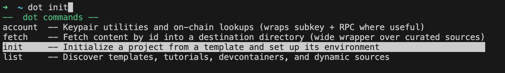

## dotcli autocompletion demo



**Run locally**

```
git clone https://github.com/charlesHetterich/tmp-rnd.git
cd tmp-rnd
pnpm install
pnpm build

export PATH="$HOME/.polkadot/bin:$PATH"
source ./shims/completion.zsh
```

## Notes

-   [zsh completion system](https://zsh.sourceforge.io/Doc/Release/Completion-System.html)
